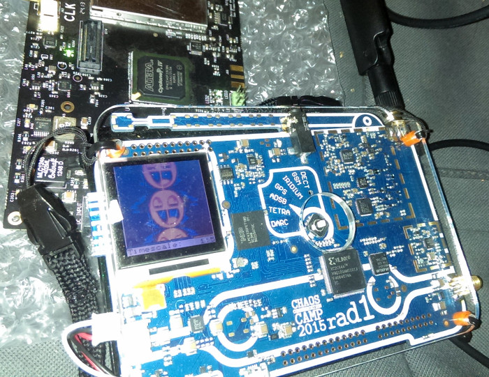

# Spectrum Painter

A tool to converts images to IQ streams that look like this when viewed in a waterfall plot.


## Setup

Installation is not required. You can run the program from the root directory of the repository using

```
python spectrum_painter/img2iqstream.py
```

If you want the program to be globally executable, you can install with pip. I recommend a developer install. From the root of the repository, this is done (for the current user) by

```
pip install --user -e .
```

Afterwards, the _img2iqstream_ is available from everywhere.

## Usage

Here is the program help, also available using _img2iqstream --help_.

```
Usage: img2iqstream [OPTIONS] [SRCS]...

Options:
  -s, --samplerate INTEGER        Samplerate of the radio
  -l, --linetime FLOAT            Time for each line to show
  -o, --output FILENAME           File to write to (default: stdout)
  --format [float|bladerf|hackrf]
                                  Output format of samples
  --help                          Show this message and exit.
```

 * Samplerate is what you will configure in your radio later. About half of that bandwidth is actually used for the image. The edges are left free since I've seen some pretty ugly bandfilter effects sometimes.
 * Linetime is the time in seconds that each line of your images will display. Experiment a bit here, usually a good starting value is around 0.005 - 0.01.
 * Output is the file to write to. Per default this is stdout.
 * Format selects the output formatter. There is support for bladerf and hackrf radio formats as well as raw I/Q interleaved 32-bit float samples.
 * You can pass multiple images to the program which will all be converted and written to the output.

The FFT adapts to the image size. However, I've not tried what happens for very wide or narrow images. Pictures with a horizontal resolution between about 512-2048 pixels seem to work fine, though. Only the first color channel of the image is used, so images should be black and white. 

### HackRF Example

Convert the smiley example for the HackRF.

```
img2iqstream -s 1000000 -l 0.004 -o smiley.iqhackrf --format hackrf examples/smiley.png
```

Then transmit using _hackrf_transfer_.

```
hackrf_transfer -t smiley.iqhackrf -f 2450000000 -b 1750000 -s 1000000 -x 20 -a 1
```

*NOTE:* I've got some reports that the above does not work with some original HackRF boards. Increasing the samplerate and bandwidth to 8 MHz seems to help in that case. If you have a rad1obadge, the lines above should work.

### BladeRF Example

Convert the smiley example for the BladeRF

```
img2iqstream -s 1000000 -l 0.004 -o smiley.iqblade --format bladerf examples/smiley.png
```

The output can be used in bladeRF-cli with bin format.

# Closing

This was a fun project at this years [Chaos Communication Camp](https://events.ccc.de/camp/2015/wiki/Main_Page). It even works with a spectrum analyzer on the awesome rad1obadge ;).


